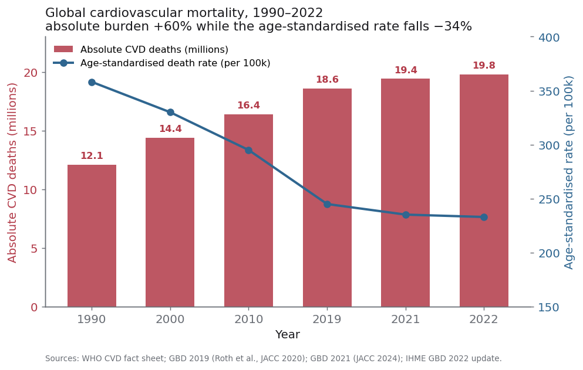
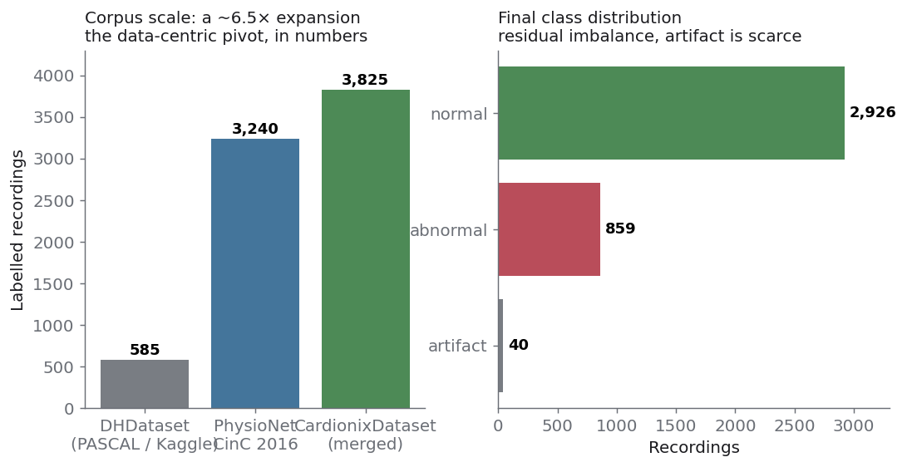
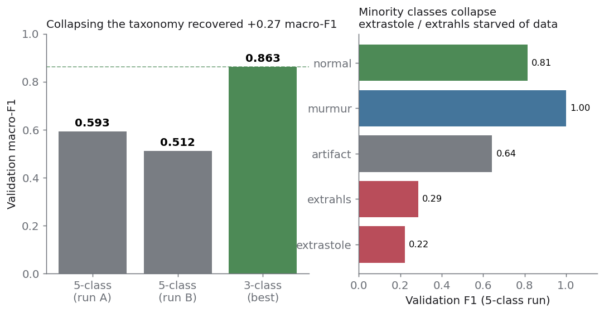
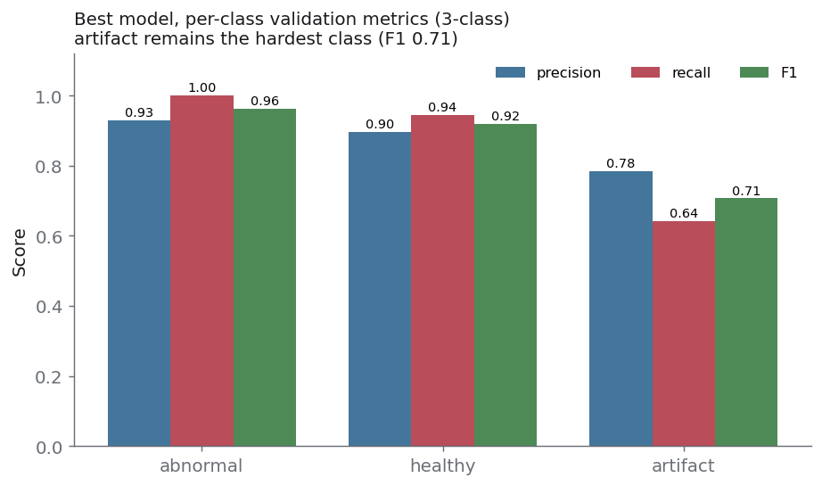
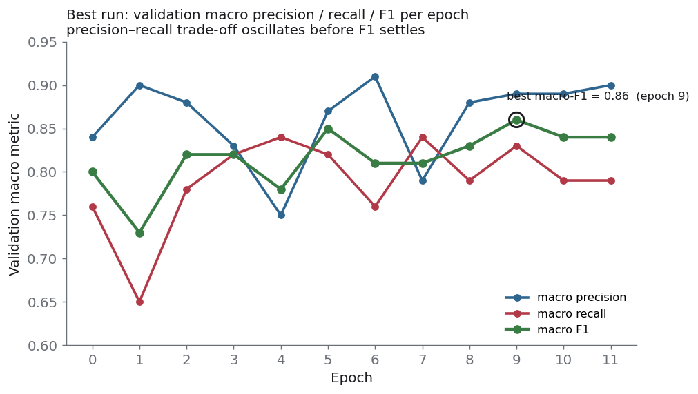

<div align="center">

# Cardionix

### Screening for cardiac pathology from smartphone-captured phonocardiograms

**A research pipeline and its findings on early, pre-symptomatic detection of cardiovascular disease from heart-sound audio recorded on consumer devices.**

<sub>PyTorch Lightning · Pydantic-typed experiment configs · Weights & Biases · domain-specific DSP</sub>

<sub>Status: research prototype. Not a medical device. See [§12 Limitations](#12-limitations).</sub>

</div>

---

> **Reading guide.** This document is written as a research report. It records not only what worked, but the order in which we understood the problem, the experiments that failed, and the two moments where the project changed direction. The companion documents in [`/docs`](docs) hold the technical appendices (full derivations, per-run tables, architecture specifications, bibliography). Every figure in this README is regenerated from the real artifacts of the project by [`docs/make_figures.py`](docs/make_figures.py).

## Table of contents

1. [Abstract](#1-abstract)
2. [Motivation](#2-motivation)
3. [Problem framing: why smartphone PCG is not ordinary audio ML](#3-problem-framing-why-smartphone-pcg-is-not-ordinary-audio-ml)
4. [Related work](#4-related-work)
5. [Data: building the corpus](#5-data-building-the-corpus)
6. [Experimental framework](#6-experimental-framework)
7. [Signal representation and preprocessing](#7-signal-representation-and-preprocessing)
8. [Model architectures: the CardioNet family](#8-model-architectures-the-cardionet-family)
9. [Validation protocol](#9-validation-protocol)
10. [Experiments and results](#10-experiments-and-results)
11. [The turn to a data-centric method: cardiobit and the recording protocol](#11-the-turn-to-a-data-centric-method-cardiobit-and-the-recording-protocol)
12. [Limitations](#12-limitations)
13. [Future work](#13-future-work)
14. [Repository layout and reproducibility](#14-repository-layout-and-reproducibility)
15. [References](#15-references)

---

## 1. Abstract

Auscultation of the heart is one of the oldest diagnostic acts in medicine, yet it still requires a stethoscope and a trained listener. We ask whether the microphone of a commodity smartphone captures the cardiac acoustic signal with sufficient fidelity to support automatic triage of *normal* versus *abnormal* heart sounds, and therefore whether large-scale, pre-symptomatic screening could be moved outside the clinic.

We assembled a phonocardiographic (PCG) corpus, repaired and standardised it, and grew it from **585** to **3,825** labelled recordings by integrating the PhysioNet/CinC 2016 database. We built a configuration-driven experimental framework on PyTorch Lightning and used it to run a systematic search over signal representations, class taxonomies, and network architectures (the *CardioNet* family: a convolutional-recurrent baseline, a multimodal residual-recurrent variant, and a spectral-image transformer design). Our best operating point reaches a **validation macro-F1 of 0.863** (macro precision 0.870, macro recall 0.863, accuracy 0.875) on a three-class problem (*healthy* / *abnormal* / *artifact*).

Two findings organise the report. First, **collapsing an over-fragmented five-class taxonomy into three clinically meaningful classes recovered +0.27 macro-F1**, because the rare classes (*extrasystole*, *extra heart sound*) were starved of data and collapsed to near-zero recall. Second, once architectural search stopped paying off, the binding constraint was shown to be **the representation and volume of the signal, not the capacity of the model**. That diagnosis moved the work from model-centric to data-centric, and produced two spin-off tools: [`cardiobit`](https://github.com/Cardionix/cardiobit), a domain-specific DSP library for PCG preprocessing and quality assessment, and [`cardiolab-studio`](https://github.com/Cardionix/cardiolab-studio), an interactive workbench for before/after signal analysis. We deliberately did not pursue clinical deployment; the error cost of a screening decision demands a separate class of validation that this project does not claim.

## 2. Motivation

Cardiovascular disease (CVD) is the leading cause of death worldwide. The World Health Organization attributes roughly **17.9 million deaths per year** to CVD, about **31% of all global mortality**, of which some 85% are due to myocardial infarction and stroke [[WHO]](#ref-who). The burden is not static. Analyses from the Global Burden of Disease programme show the **absolute** number of CVD deaths rising from **12.1 million in 1990 to 19.8 million in 2022**, an increase of roughly 60%, driven by population growth, ageing, and preventable metabolic and behavioural risk [[GBD 2019]](#ref-gbd2019) [[GBD 2021]](#ref-gbd2021) [[IHME]](#ref-ihme).

<div align="center">

</div>

The nuance in this figure is the whole argument for screening. The **age-standardised** death rate has *fallen* by about 34% over the same period (from 358 to 235 per 100,000), a genuine success of treatment and prevention. Yet the **absolute** toll keeps climbing, and more than three quarters of CVD deaths now occur in low- and middle-income countries where diagnostic infrastructure is thin [[WHO]](#ref-who). Roughly a third of these deaths are premature, before the age of 70. The gap between a falling per-capita risk and a rising absolute burden is exactly the space that a cheap, scalable, pre-symptomatic screening instrument would occupy: not a diagnosis, but a triage signal that tells an asymptomatic person *you should see a clinician*.

A smartphone is the only sensor already in three billion pockets. If its microphone can register the first (S1) and second (S2) heart sounds and the murmurs that ride between them with enough fidelity to separate *normal* from *abnormal*, the marginal cost of one more screening approaches zero. That is the hypothesis this project set out to test.

## 3. Problem framing: why smartphone PCG is not ordinary audio ML

One physical fact shaped every decision that followed. When a phone is pressed to the chest, its microphone does **not** record the airborne pressure wave that a clinician hears through a stethoscope diaphragm. It records vibration that has propagated through biological tissue: skin, subcutaneous fat, muscle, and the thoracic wall. That medium is a heterogeneous, layered viscoelastic structure. It behaves as a low-pass acoustic filter with pronounced attenuation at higher frequencies, and its transfer function depends on the pickup point, the contact pressure, and the body habitus of the subject.

Formally, if $s(t)$ is the acoustic source at the valve and $h_{\text{tissue}}(t)$ the impulse response of the propagation path, the captured signal is approximately

$$
x(t) = \big(s * h_{\text{tissue}}\big)(t) + n_{\text{env}}(t) + n_{\text{contact}}(t),
$$

where $n_{\text{env}}$ is airborne environmental noise leaking into the microphone and $n_{\text{contact}}$ is friction and motion noise from the skin-device interface. The diagnostic energy of heart sounds lives in a narrow low band, roughly **20 to 200 Hz**, with S1 (mitral and tricuspid closure) slightly lower and longer than S2 (aortic and pulmonic closure). Tissue attenuation therefore erodes precisely the high-frequency detail that distinguishes a soft murmur from clean flow, while contact and environmental noise occupy overlapping bands.

This has two consequences that separate the task from mainstream audio ML.

1. **Domain shift from pretrained audio models is severe.** Models pretrained on speech and environmental sound (AudioSet-scale corpora) have learned statistics of an airborne, wide-band, semantically rich signal. Our signal is band-limited, tissue-filtered, quasi-periodic, and semantically sparse. Transfer offers little and can mislead.
2. **Acquisition is part of the model.** Because $h_{\text{tissue}}$ and the noise terms are set at capture time, controlling *how* the recording is made is not preprocessing hygiene, it is a first-class lever on accuracy. This insight later became a full experiment (see [§11](#11-the-turn-to-a-data-centric-method-cardiobit-and-the-recording-protocol)).

## 4. Related work

Heart-sound classification has a mature literature. The two open datasets that anchor the field are the **PASCAL Classifying Heart Sounds Challenge** (Bentley et al., 2011) [[PASCAL]](#ref-pascal), which introduced the five-way *normal / murmur / extrasystole / extra heart sound / artifact* taxonomy we started from, and the **PhysioNet/CinC Challenge 2016** (Liu et al.; Clifford et al.) [[PhysioNet2016]](#ref-physionet) [[Clifford2016]](#ref-clifford), the largest public PCG database, aggregated from nine sources with a binary *normal / abnormal* label.

On the modelling side, lightweight 2-D CNNs on mel-spectrograms report high accuracy on normal/abnormal splits; **CardioXNet** (Baghel et al.) is a representative lightweight design [[CardioXNet]](#ref-cardioxnet). Hybrid CNN + recurrent models capture the temporal structure of the cardiac cycle, and end-to-end learnable front ends such as **SpectNet** learn the filterbank jointly with the classifier [[SpectNet]](#ref-spectnet). Classical PCG pipelines depend on accurate S1/S2 **segmentation**; the logistic-regression HSMM of Springer et al. remains the reference method [[Springer2016]](#ref-springer). Our architectural choices (pre-activation residual units [[He2016]](#ref-he), self-attention encoders [[Vaswani2017]](#ref-vaswani), continuous wavelet front ends) and our denoising (Donoho and Johnstone universal wavelet shrinkage [[Donoho1994]](#ref-donoho)) all draw on this body of work. A fuller survey with per-method numbers is in [`docs/NAS-For-V3.md`](docs/NAS-For-V3.md).

Where we differ from most of this literature is the target sensor. The published results overwhelmingly assume stethoscope-grade capture (the PhysioNet sources are clinical). Our question is what survives when the sensor is a phone pressed to clothed skin, which is why acquisition and data quality, not architecture, became the centre of gravity of the project.

## 5. Data: building the corpus

> Full detail, including the metadata schema and the merge logic, is in [`docs/01-data-corpus.md`](docs/01-data-corpus.md).

### 5.1 The corpus was the hard part

A survey of open sources (Kaggle, Google Dataset Search, the PCG literature) confirmed a chronic scarcity of usable heart-sound corpora. The one public dataset we could build on, derived from the PASCAL challenge, arrived in an unusable state: the correspondence between label files and audio filenames was broken, formats and sample rates were heterogeneous, the class distribution was severely imbalanced, and there was no structured metadata. A large fraction of the early work was unglamorous data engineering, and it mattered more than any single model change.

We rebuilt the corpus from the ground up:

- **Recovered the label-to-audio mapping** that the original release had lost.
- **Standardised** every file to a single container and canonical sample rate, mono, with a consistent UUID naming regime and a reorganised storage layout.
- **Enriched with metadata** (`filename, label, duration, sr, device, source, date`) so that every recording carries its provenance, which later made multi-source merging auditable. This cleaned artifact is published as the **Dangerous Heartbeat Dataset (DHD)**.

### 5.2 Extending the artifact class with field recordings

The *artifact* class (recordings in which no heartbeat is identifiable) is what lets a screening app say "this recording is unusable, try again" instead of silently misclassifying noise. It was the scarcest class and the most important for real-world robustness. Rather than treat it as noise to be discarded, we treated it as a class to be modelled.

We first analysed the operating conditions of the intended application and enumerated the acoustic interference typical of them (human speech, breathing into the microphone, cloth and contact friction, ambient room and street noise, digital and electronic interference, medical-environment sounds). That taxonomy of noise domains, and the recording checklist it produced, is preserved in [`docs/NOISE_CATEGORY_MINING.md`](docs/NOISE_CATEGORY_MINING.md). We then collected field recordings against it, both isolated noise and heavily contaminated phonocardiograms captured indoors and outdoors, and folded them into the artifact class. The goal was twofold: to relieve the class imbalance, and to make the corpus representative of the conditions the application would actually meet.

### 5.3 The data-centric expansion: PhysioNet

When architectural search plateaued (see [§10](#10-experiments-and-results)), we treated the shortage of data as the primary problem and integrated the **PhysioNet/CinC 2016** database. This is the step that turned a small experiment into a corpus with statistical weight.

<div align="center">

</div>

The corpus evolved in three generations:

| Generation | Source | Records | Labels |
|---|---|---:|---|
| **DHDataset** | PASCAL / Kaggle (iStethoscope @ 44.1 kHz, DigiScope @ 4 kHz) + field recordings | 585 labelled (+247 unlabelled) | normal 351, murmur 129, extrastole 46, extrahls 19, artifact 40 |
| **PhysioNetDataset** | PhysioNet/CinC 2016 (@ 2 kHz) | 3,240 | normal 2,575, abnormal 665 |
| **CardionixDataset** | merged and harmonised | **3,825** | normal 2,926, abnormal 859, artifact 40 |

The corpus grew roughly **6.5×**. This is the data-centric pivot expressed in a single number, and it changed which experiments were worth running.

### 5.4 Classes, splits, and one limitation stated up front

The operational taxonomy merges the raw labels into three classes via a configurable rule: `abnormal = {murmur, extrahls, extrastole}`, `healthy = normal`, `artifact = artifact`. The rationale for this merge is the central experimental result of [§10](#10-experiments-and-results).

Data are split into training and validation partitions (primary ratio 0.7 / 0.3; an 0.8 / 0.2 variant and a three-way split with a held-out test set were used to check for leakage from repeated hyperparameter selection on the validation fold).

**One limitation must be stated before any metric is read.** Patient-level splitting was impossible: the source corpora carry no subject identifiers. Recordings from the same individual can therefore fall on both sides of the split, so our reported scores are **optimistically biased** relative to a clean subject-disjoint evaluation. Removing this bias requires a proprietary corpus that preserves the recording-to-subject link, which is the first item of [future work](#13-future-work).

## 6. Experimental framework

To make hypotheses cheap to test and results reproducible, we built a configuration-driven framework on **PyTorch Lightning** with logging to **Weights & Biases**. The design principle is that an experiment is *data*, not code.

Every run is specified by **Pydantic-typed configuration models** (`ClassifyDatasetParams`, `ETLPipelineParams`, `DataModuleParams`, `LightningModuleParams`). Typed configs give three things for free: validation of every input argument at construction time, an automatically logged full specification of each run, and the ability to change the feature extractor, the augmentation schedule, or the class taxonomy by editing configuration rather than code. In practice this is what let us run a *systematic* search over hypotheses instead of a scatter of one-off scripts.

The functional modules are:

- an **ETL pipeline** for audio and tabular data (resampling, duration standardisation, feature extraction);
- an **augmentation** module (applied only on the training partition, locked on validation and test);
- a **class-management** mechanism that merges or excludes classes at the configuration level;
- **splitting and iteration** components with split-correctness checks;
- **metric and probability stores** that persist per-epoch outputs and compute the classification metrics.

The practical consequence: swapping the feature extractor or the label taxonomy is a config edit, and the change is recorded in the run's logged specification. See [`docs/02-methods.md`](docs/02-methods.md) for the full configuration surface.

## 7. Signal representation and preprocessing

> Formulas and defaults in full: [`docs/02-methods.md`](docs/02-methods.md).

### 7.1 Front end

Raw audio is loaded, converted to mono, resampled to a canonical rate (the best runs use **2 kHz**, matched to the 20–200 Hz diagnostic band and the PhysioNet convention), and standardised to a fixed duration (10 s) by padding or clipping.

The primary representation is the **Mel-Frequency Cepstral Coefficient (MFCC)** sequence. The mel scale approximates the nonlinear frequency resolution of the cochlea,

$$
m(f) = 2595 \, \log_{10}\!\left(1 + \frac{f}{700}\right),
$$

and the cepstral coefficients are the discrete cosine transform of the log mel-band energies,

$$
c_k = \sum_{b=1}^{B} \log\!\big(E_b\big)\,\cos\!\Big[\frac{\pi k}{B}\big(b - \tfrac{1}{2}\big)\Big],
\qquad k = 1,\dots,K .
$$

The best-run configuration uses $K = 128$ coefficients over $B = 128$ mel bands, an FFT window of 2048 with a hop of 1024. The output is a $(K \times T)$ time-frequency matrix consumed by the recurrent and residual encoders of [§8](#8-model-architectures-the-cardionet-family).

### 7.2 Domain-specific augmentation

Because the corpus is small and the signal is quasi-periodic, we implemented augmentations tuned to PCG rather than generic audio transforms: **time-stretch** (rate 0.5–1.8, perturbing apparent heart rate), **amplitude scaling** (0.5–3.0), **pitch shift** (±5 semitones), additive **Gaussian noise** (coefficient $0.005 \cdot \max|x|$), **same-class mixing** (`noise_by`, blending a sample with another of the same class at coefficient 0.05–0.3), and **harmonic-percussive source separation** (HPSS) with a randomised remix, which lets the model see the S1/S2 transients and the murmur texture in different proportions. An honest note: our single best operating point was reached with augmentation *disabled*, which is itself a result about where the bottleneck was (see [§10.3](#103-the-diagnosis-model-capacity-was-not-the-bottleneck)).

## 8. Model architectures: the CardioNet family

> Layer-level specifications: [`docs/03-architectures.md`](docs/03-architectures.md).

We deliberately chose **not** to fine-tune large pretrained audio models, for three reasons. (1) *Domain shift*: as argued in [§3](#3-problem-framing-why-smartphone-pcg-is-not-ordinary-audio-ml), the tissue-filtered signal is far from the speech/environmental distributions those models learned. (2) *Corpus size*: fine-tuning a large model on data of this scale invites overfitting and does not address the real constraint. (3) *Research economy*: the question at this stage was how the signal should be *represented*, and lightweight models make that iteration an order of magnitude cheaper. The family evolved in three generations.

### 8.1 CardioNet V1: convolutional-recurrent baseline

A 1-D convolutional encoder learns local time-domain features (`Conv1d` with kernel 5, `BatchNorm1d`, ReLU, `MaxPool1d`), a stacked **LSTM** models the temporal structure of the cardiac cycle, and a fully connected decoder emits class logits. A representative configuration is encoder channels `[2048, 1024, 512]`, recurrent widths `[256, 128]`, decoder `[64, 32, C]`. The convolutional stack acts as a learned filterbank; the recurrent stack captures the systole–diastole rhythm that distinguishes a regular beat from an extrasystole.

### 8.2 CardioNet V2: a multimodal residual-recurrent experiment

V2 fuses two branches. The audio branch feeds the MFCC sequence through a **bidirectional LSTM** (hidden size auto-sized as $\lfloor \tfrac{2}{3} n_{\text{mfcc}} \rfloor + n_{\text{mfcc}}$) into a **pre-activation residual network** (ResNet-18-style groups `{64:2, 128:2, 256:2, 512:2}`, each unit ordered BatchNorm → ReLU → Conv, with 1×1 projection shortcuts and global average pooling) [[He2016]](#ref-he). A tabular branch processes questionnaire-style features through dense layers, and a `DenseMixer` concatenates the two representations before the classifier.

**A caveat we raise ourselves, because it is the first question a reviewer should ask.** The tabular branch was wired to an external population-survey source (a CDC-style questionnaire), whose respondents are **not** the same individuals as the PCG recordings. The audio–table pairs are therefore not per-subject aligned. **CardioNet V2 is correctly described as an architectural experiment in multimodal fusion, not as a validated multimodal diagnostic model.** We report the architecture; we do not claim a working multimodal result from it.

### 8.3 CardioNet V3: spectral-image transformer (design stage)

V3 abandons the 1-D view. Each recording is rendered into three complementary time-frequency representations and stacked as a three-channel "image" analogous to RGB:

1. **STFT** magnitude, for stationary harmonic structure;
2. **Mel-spectrogram**, for perceptually weighted frequency content;
3. **Continuous Wavelet Transform** (Morlet), for high temporal resolution on transients (murmur onsets and artifacts), where the analysis scale is $a = f_c \cdot f_s / f$ for centre frequency $f_c$.

The stacked tensor $[3, 128, 128]$ passes through a **ResNet-18** backbone for local spatial features; the resulting feature grid is flattened into a token sequence and processed by a **Transformer encoder** [[Vaswani2017]](#ref-vaswani) that models long-range dependencies between spectral regions, before a classification head. The rationale, the wavelet derivation, and a small neural-architecture-search survey are in [`docs/CardionetV3.md`](docs/CardionetV3.md) and [`docs/NAS-For-V3.md`](docs/NAS-For-V3.md). V3 is at the design and prototyping stage; we present it as the intended next architecture, not as a reported result.

## 9. Validation protocol

Checkpoints are selected on **macro-F1**, the harmonic mean of precision and recall averaged with equal weight across classes, which is the right objective under class imbalance because it refuses to let the majority class dominate:

$$
F_1^{(c)} = \frac{2\,P_c R_c}{P_c + R_c},
\qquad
\text{macro-}F_1 = \frac{1}{C}\sum_{c=1}^{C} F_1^{(c)} .
$$

We track per-class precision, recall, F1, weighted and macro averages, and a generalised $F_\beta$ (with $\beta = 1.10$, slightly favouring recall, appropriate for a screening instrument where a missed abnormality is costlier than a false alarm). We also log a multi-class ROC-AUC, but see the honest note in [§10.4](#104-an-instrumentation-failure-we-are-not-hiding). Optimisation uses Adam at learning rate $10^{-4}$ with `ReduceLROnPlateau` (patience 5) on validation loss, cross-entropy loss

$$
\mathcal{L} = -\sum_{c=1}^{C} w_c\, y_c \log \hat{p}_c ,
$$

batch size 20, early stopping (patience 10) on validation loss, seed fixed at 42.

## 10. Experiments and results

### 10.1 The five-class taxonomy collapsed

Our first serious runs used the full PASCAL five-class taxonomy. They failed in an informative way. The two rarest classes, *extrasystole* (46 samples) and *extra heart sound* (19 samples), were starved of data and collapsed: validation F1 for *extrasystole* fell to **0.22 and then to 0.00**, and *extra heart sound* to **0.29**. Macro-F1 across two representative five-class runs was **0.593 and 0.512**. Per-class scores on the tiny minority folds were also unstable (a spuriously perfect murmur F1 on one run reflects a handful of validation samples, not a solved class).

<div align="center">

</div>

### 10.2 Collapsing the taxonomy recovered +0.27 macro-F1

The diagnosis was that the five-class problem was not the *clinically* meaningful one, and it was fragmenting scarce data across labels that a screening tool does not need to separate. A murmur, an extrasystole, and an extra heart sound are all, for triage purposes, *not-normal*. Merging `{murmur, extrahls, extrastole}` into a single **abnormal** class, and keeping **healthy** and **artifact**, lifted validation macro-F1 from ~0.51–0.59 to **0.863**. This is the single largest improvement in the project, and it came from reframing the label space, not from a bigger network.

Best operating point (3-class, W&B run `sfqx9n2b`):

| Metric | Value |
|---|---:|
| Validation macro-F1 | **0.863** |
| Validation macro precision | 0.870 |
| Validation macro recall | 0.863 |
| Validation accuracy | 0.875 |
| Validation weighted-F1 | 0.871 |
| Validation loss | 0.284 |

Per-class validation metrics:

| Class | Precision | Recall | F1 |
|---|---:|---:|---:|
| abnormal | 0.929 | 1.000 | 0.963 |
| healthy | 0.896 | 0.945 | 0.920 |
| artifact | 0.784 | 0.643 | **0.707** |

<div align="center">

</div>

*Artifact* remains the hardest class (F1 0.707), which is consistent with it being the most heterogeneous and the scarcest. Its low recall (0.643) means the model still lets some unusable recordings through as if they were heart sounds, precisely the failure mode the field-recording effort of [§5.2](#52-extending-the-artifact-class-with-field-recordings) was meant to attack, and precisely why artifact volume is a data priority.

The per-epoch trajectory of the best run, read directly from the saved checkpoint filenames, shows the precision–recall trade-off oscillating before macro-F1 settles at its peak at epoch 9:

<div align="center">

</div>

### 10.3 The diagnosis: model capacity was not the bottleneck

Once the taxonomy was fixed, further changes to architecture and hyperparameters stopped producing gains. The learning curves plateaued regardless of network depth or recurrent width. The interpretation is a standard one but it is the hinge of the whole project: when the model class is already expressive enough to fit the signal, additional capacity does nothing, and the binding constraint moves to the **volume and quality of the data and the separability of the representation**. That is what redirected the work from model-centric to data-centric, and produced both the PhysioNet expansion of [§5.3](#53-the-data-centric-expansion-physionet) and the `cardiobit` line of [§11](#11-the-turn-to-a-data-centric-method-cardiobit-and-the-recording-protocol).

### 10.4 An instrumentation failure we are not hiding

The logged multi-class ROC-AUC reads a constant **0.4000** across every run, training and validation alike. A metric that does not move with model quality is not measuring model quality; this is a bug in the one-versus-one AUC logging path, not a property of the models. We therefore **do not report ROC-AUC as a result**, and we flag it as an instrumentation gap to be fixed before the next round. We prefer to surface this than to quote a number we do not trust. Probability **calibration** was likewise not evaluated, which for a screening application is a real gap (see [§12](#12-limitations)).

## 11. The turn to a data-centric method: cardiobit and the recording protocol

> This section is the "we hit a wall, and here is what we did about it" part of the story. Extended version: [`docs/05-cardiobit-and-recording-protocol.md`](docs/05-cardiobit-and-recording-protocol.md).

### 11.1 Why a separate library

When the plateau of [§10.3](#103-the-diagnosis-model-capacity-was-not-the-bottleneck) made it clear that the representation was the limiting factor, we did not simply add another preprocessing function to the pipeline. We needed to *experiment* on the signal itself: to try filters, denoisers, and quality measures rapidly and compare their effects. Early notes on a universal smartphone-PCG preprocessor (preserved in [`docs/R.MD`](docs/R.MD) and [`docs/R4o.MD`](docs/R4o.MD)) grew past what belonged inside a training pipeline. So we factored the signal-processing work out into a standalone, reusable library, [**`cardiobit`**](https://github.com/Cardionix/cardiobit).

Its purpose is twofold: (a) find a feature extraction that **increases class separability by reducing the complexity of the representation**, moving load off the model and onto the front end; and (b) find **domain-specific augmentations** that widen the corpus's variance without distorting diagnostic content.

`cardiobit` implements a focused DSP toolkit for PCG:

- **Bandpass filtering.** A zero-phase Butterworth filter over the cardiac band (default 20–200 Hz, order 4), whose analogue prototype magnitude is $|H(j\omega)|^2 = \big[1 + (\omega/\omega_c)^{2n}\big]^{-1}$, applied forward-and-backward (`filtfilt`) to avoid phase distortion of the S1/S2 timing.
- **Denoising**, three interchangeable paths: adaptive Wiener filtering; non-stationary spectral gating; and **wavelet shrinkage** with the Donoho–Johnstone universal threshold $u = \sigma\sqrt{2\ln N}$, where $\sigma = \operatorname{median}(|c_{J}|)/0.6745$ is the robust noise estimate from the finest detail coefficients [[Donoho1994]](#ref-donoho).
- **Quality metrics**: SNR (percentile-based noise floor), dynamic range, clipping ratio, spectral purity (in-band energy fraction), and **spectral entropy** $H = -\sum_f P(f)\log_2 P(f)$ over the normalised power spectrum.
- **Biometric metrics**: heart rate and heart-rate variability (SDNN) via a Hilbert-envelope beat detector, and the S1/S2 amplitude ratio.

Each metric carries an explicit **trust level** that reflects its noise sensitivity (dynamic range and clipping are robust; the S1/S2 ratio is fragile because it depends on correct S1/S2 separation). This is unusual and deliberate: a quality tool that hides its own uncertainty is worse than useless in a screening context.

### 11.2 A proxy metric for signal quality

There is no direct ground-truth label for "did this processing step improve the signal." We introduced an indirect one. On a cleaner signal, an automatic beat detector agrees more closely with a human's count of heartbeats. We therefore use the discrepancy between a **manual heartbeat count** and the **algorithmic** count as a proxy for signal quality:

$$
Q = -\,\big|\, N_{\text{manual}} - N_{\text{algo}} \,\big| ,
$$

so that a processing pipeline which reduces the count error is, by this proxy, improving the signal. It is not a perfect measure, but it is an *operational* one, and it let us rank preprocessing configurations instead of arguing about spectrograms by eye.

### 11.3 cardiolab-studio: making the comparison interactive

To run those comparisons quickly we built [**`cardiolab-studio`**](https://github.com/Cardionix/cardiolab-studio), a Streamlit workbench. It loads a recording, applies a user-configured processing chain (`load → normalize → bandpass → wiener → wavelet → custom`), and shows the signal **before and after** side by side: waveform, STFT spectrogram, mel-spectrogram, an audio player, and the `cardiobit` quality and biometric metrics with their trust levels. It turns "test a preprocessing hypothesis" from a code edit into a slider.

### 11.4 Acquisition as an experiment

Following the argument of [§3](#3-problem-framing-why-smartphone-pcg-is-not-ordinary-audio-ml) that acquisition is part of the model, we ran a series of experiments on **how** the recording is made, varying the pickup point on the torso, body posture, background noise level, device model, contact pressure, and whether a protective case is fitted. The outcome is a **recording protocol**: upright posture, pickup in the intercostal space over the cardiac projection, case removed. The methodological point generalises beyond the specific settings: **under a data-constrained regime, improving acquisition quality is a more effective lever than adding model capacity.** It is cheaper to record better than to learn harder.

## 12. Limitations

We state these plainly because a screening claim is only as credible as its stated failure modes.

- **No patient-level split.** The source corpora lack subject identifiers, so recordings from one person may appear in both partitions. Reported scores are optimistically biased.
- **Corpus size and imbalance.** Even at 3,825 records the corpus is modest for a medical task, and the *artifact* class in particular is scarce (40 labelled), which caps its recall.
- **No clinical reference standard.** Labels are not confirmed by instrumental diagnosis (echocardiography, ECG), so "abnormal" means "abnormal-sounding," not a verified pathology.
- **No external validation.** The model has not been evaluated on an independent cohort collected under different conditions.
- **No calibration or uncertainty quantification.** Predicted probabilities were not calibrated, and predictive uncertainty was not estimated. For a screening instrument, where the output feeds a referral decision, this is essential and currently absent.
- **Instrumentation gap.** The ROC-AUC logging is broken (§10.4) and was not used.

For all of these reasons we deliberately did **not** advance the system toward clinical use. Medical triage carries an asymmetric error cost that demands a separate validation regime this research prototype does not provide.

## 13. Future work

1. **A proprietary corpus with a clinical reference and subject IDs**, enabling correct patient-disjoint splitting and lifting the optimistic bias.
2. **Self-supervised pretraining** on unlabelled PCG (contrastive or masked-reconstruction objectives), to exploit abundant unlabelled recordings and address the domain shift that rules out speech-pretrained backbones.
3. **Calibration and uncertainty quantification** (temperature scaling, deep ensembles, or evidential heads), reported as reliability diagrams, because a screening decision needs a trustworthy probability, not just a class.
4. **Finishing CardioNet V3** (the STFT + mel + wavelet spectral-image transformer) and the fixed AUC instrumentation.
5. **On-device inference**, exporting via ONNX (a working export path already exists in the pipeline) for private, offline screening on the phone that made the recording.

## 14. Repository layout and reproducibility

```
cardionix-pipeline/
├── README.md                     # this research report
├── main.py                       # entry point: builds configs, runs a training experiment
├── configs.py                    # example experiment configuration
├── callbacks.py                  # checkpointing / early-stopping callbacks
├── cardionix/                    # the framework
│   ├── configs/                  #   Pydantic-typed experiment configs
│   ├── engine/                   #   Lightning module, metrics
│   ├── models/                   #   CardioNet family (baseline, v2, utils: resnet, mixer)
│   └── pipeline/                 #   ETL, preprocessing, extractors, augmentation
├── data/                         # DHDataset, PhysioNetDataset, CardionixDataset (+ annotations)
├── notebooks/                    # EDA, dataset merge/transform, V3 development, multimodal, ONNX
├── checkpoints/                  # saved checkpoints (metrics encoded in filenames)
├── docs/                         # technical appendices, figures, references
│   ├── assets/                   #   figures, regenerated by make_figures.py
│   ├── 01-data-corpus.md
│   ├── 02-methods.md
│   ├── 03-architectures.md
│   ├── 04-experiments-results.md
│   ├── 05-cardiobit-and-recording-protocol.md
│   ├── CardionetV3.md · NAS-For-V3.md · NOISE_CATEGORY_MINING.md
│   └── REFERENCES.md
└── requirements.txt
```

```bash
# environment
pip install -r requirements.txt

# regenerate every figure in this README from the real project artifacts
python3 docs/make_figures.py

# run a training experiment (edit configs.py / callbacks.py first)
python3 main.py
```

Companion repositories: [`cardiobit`](https://github.com/Cardionix/cardiobit) (PCG DSP library) and [`cardiolab-studio`](https://github.com/Cardionix/cardiolab-studio) (interactive analysis workbench).

## 15. References

The full annotated bibliography, with DOIs and identifiers, is in [`docs/REFERENCES.md`](docs/REFERENCES.md). Key sources:

<a id="ref-who"></a>[WHO] World Health Organization. *Cardiovascular diseases (CVDs) fact sheet.* World Health Organization.

<a id="ref-gbd2019"></a>[GBD 2019] Roth G. A. et al. *Global Burden of Cardiovascular Diseases and Risk Factors, 1990–2019: Update From the GBD 2019 Study.* Journal of the American College of Cardiology, 76(25):2982–3021, 2020. doi:10.1016/j.jacc.2020.11.010

<a id="ref-gbd2021"></a>[GBD 2021] *Global, Regional, and National Burden of Cardiovascular Disease, 1990–2021: Results From the 2021 Global Burden of Disease Study.* Journal of the American College of Cardiology, 2024.

<a id="ref-ihme"></a>[IHME] Institute for Health Metrics and Evaluation. *Global burden of cardiovascular diseases and risks, 1990–2022.*

<a id="ref-pascal"></a>[PASCAL] Bentley P., Nordehn G., Coimbra M., Mannor S. *The PASCAL Classifying Heart Sounds Challenge (CHSC2011).* 2011.

<a id="ref-physionet"></a>[PhysioNet2016] Liu C., Springer D. et al. *An open access database for the evaluation of heart sound algorithms.* Physiological Measurement, 37(12):2181–2213, 2016.

<a id="ref-clifford"></a>[Clifford2016] Clifford G. D. et al. *Classification of Normal/Abnormal Heart Sound Recordings: the PhysioNet/Computing in Cardiology Challenge 2016.* Computing in Cardiology, 2016.

<a id="ref-springer"></a>[Springer2016] Springer D. B., Tarassenko L., Clifford G. D. *Logistic Regression-HSMM-Based Heart Sound Segmentation.* IEEE Transactions on Biomedical Engineering, 63(4):822–832, 2016.

<a id="ref-cardioxnet"></a>[CardioXNet] Baghel N. et al. *CardioXNet: A Novel Lightweight Deep Learning Framework for Cardiovascular Disease Classification Using Heart Sound Recordings.* arXiv:2010.01392.

<a id="ref-spectnet"></a>[SpectNet] *SpectNet: End-to-End Audio Signal Classification Using Learnable Spectrograms.* arXiv:2211.09352.

<a id="ref-he"></a>[He2016] He K., Zhang X., Ren S., Sun J. *Identity Mappings in Deep Residual Networks.* ECCV, 2016. arXiv:1603.05027

<a id="ref-vaswani"></a>[Vaswani2017] Vaswani A. et al. *Attention Is All You Need.* NeurIPS, 2017. arXiv:1706.03762

<a id="ref-donoho"></a>[Donoho1994] Donoho D. L., Johnstone I. M. *Ideal Spatial Adaptation by Wavelet Shrinkage.* Biometrika, 81(3):425–455, 1994.

---

<div align="center">
<sub>Cardionix is a research project. It is not a medical device and must not be used for diagnosis. See <a href="#12-limitations">Limitations</a>.</sub>
</div>
